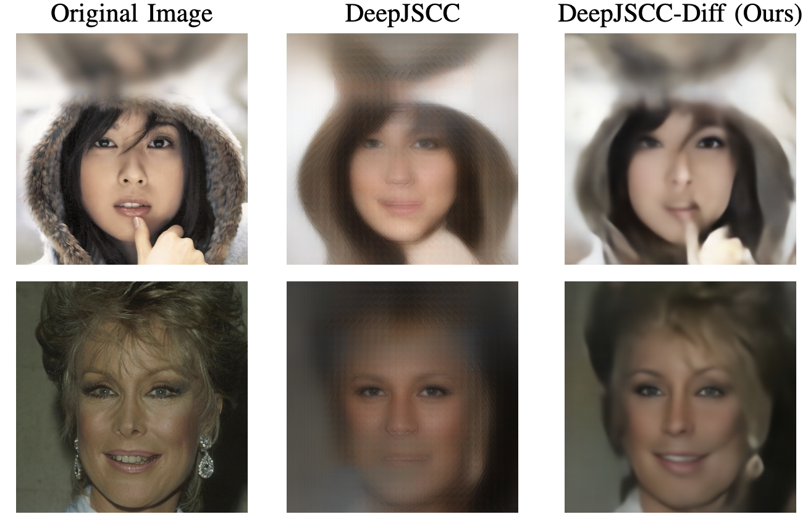

# High Perceptual Quality Wireless Image Delivery with Denoising Diffusion Models (INFOCOM 2024 DeepWireless Workshop)
This repository contains the implementation of the paper "High Perceptual Quality Wireless Image Delivery with Denoising Diffusion Models".

📖 [**Paper** (Arxiv)](https://arxiv.org/pdf/2309.15889)
📝 [**Paper** (IEEEXplore)](https://ieeexplore.ieee.org/abstract/document/10620904)


## Table of Contents
- [High Perceptual Quality Wireless Image Delivery with Denoising Diffusion Models (INFOCOM 2024 DeepWireless Workshop)](#high-perceptual-quality-wireless-image-delivery-with-denoising-diffusion-models-infocom-2024-deepwireless-workshop)
  - [Citation](#citation)
  - [Abstract](#abstract)
  - [Installation](#installation)
  - [Running the code](#running-the-code)
  - [Qualitative Comparison](#qualitative-comparison)
  - [Quantitative Comparison](#quantitative-comparison)
  - [Notes and License](#notes-and-license)


## Citation
Please cite the paper if this code or paper has been useful to you:

```
@INPROCEEDINGS{yilmaz2024perceptual,
  author={Yilmaz, Selim F. and Niu, Xueyan and Bai, Bo and Han, Wei and Deng, Lei and Gündüz, Deniz},
  booktitle={IEEE Conference on Computer Communications Workshops}, 
  title={High Perceptual Quality Wireless Image Delivery with Denoising Diffusion Models}, 
  year={2024},
  volume={},
  number={},
  pages={1-5},
  doi={10.1109/INFOCOMWKSHPS61880.2024.10620904}}
```

## Abstract
We consider the image transmission problem over a noisy wireless channel via deep learning-based joint source-channel coding (DeepJSCC) along with a denoising diffusion probabilistic model (DDPM) at the receiver. Specifically, we are interested in the perception-distortion trade-off in the practical finite block length regime, in which separate source and channel coding can be highly suboptimal. We introduce a novel scheme, where the conventional DeepJSCC encoder targets transmitting a lower resolution version of the image, which later can be refined thanks to the generative model available at the receiver. In particular, we utilize the range-null space decomposition of the target image; DeepJSCC transmits the range-space of the image, while DDPM progressively refines its null space contents. Through extensive experiments, we demonstrate significant improvements in distortion and perceptual quality of reconstructed images compared to standard DeepJSCC and the state-of-the-art generative learning-based method.

## Installation
To install environment, run the following commands after installing `Python 3.9` or above, and `torch>=1.7.1` and above for your specific training device ([Pytorch Installation](https://pytorch.org/get-started)):

```
git clone https://github.com/ipc-lab/deepjscc-diffusion.git
cd deepjscc-diffusion
conda create -f environment.yml # or pip install numpy torch blobfile tqdm pyYaml pillow    # e.g. torch 1.7.1+cu110.
conda activate diff
```

Additionally, you need to download the pre-trained model for 512x512 images from [https://huggingface.co/lowlevelware/512x512_diffusion_unconditional_ImageNet/tree/main](https://huggingface.co/lowlevelware/512x512_diffusion_unconditional_ImageNet/tree/main). After downloading, you need to place the model in the `models` folder.

## Running the code
To run the code, you can use the following command:
```
python main.py --config imagenet_512.yml --path_y <RESULT_PATH> --eta 0.85 --deg "sr_averagepooling" --deg_scale 2 --sigma_y 0.0 --target <IMAGE_PATH> --ni --batch_size 16 &&
```

## Qualitative Comparison


## Quantitative Comparison


## Notes and License
This code is adapted from [DDNM](https://github.com/wyhuai/DDNM) and has been modified for specific use. We thank the authors for sharing their code. Therefore, when using, please ensure compliance with the [original code's license](https://github.com/wyhuai/DDNM/blob/main/LICENSE.txt). If you use this code, please also cite the [DDNM paper](https://arxiv.org/pdf/2212.00490).
